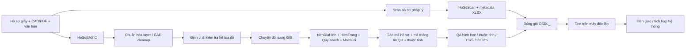

# 🗺️ TT16 — 35 Template Geodatabase cho CSDL quy hoạch đô thị & nông thôn

> Bộ template File Geodatabase phục vụ **cụ thể hóa Phụ lục II** về cơ sở dữ liệu quy hoạch đô thị và nông thôn: **34 tỉnh/thành + 01 mẫu liên tỉnh/múi chiếu 6°**. Repository tập trung vào quy trình thực hành: từ hồ sơ gốc → hồ sơ pháp lý số hóa → GIS → QA/QC → đóng gói bàn giao/tích hợp.

[](https://vanban.chinhphu.vn/?classid=1&docid=214424&pageid=27160&typegroupid=6)
[](https://chinhphu.vn/?classid=2629&docid=218798&pageid=27160)
[](./templates/generated/)

## 1. Mục tiêu

Repository giúp cơ quan quản lý, đơn vị tư vấn và cán bộ lập quy hoạch dựng một bộ hồ sơ điện tử có cấu trúc rõ ràng, dễ kiểm tra và dễ tích hợp vào hệ thống thông tin/CSDL quốc gia về hoạt động xây dựng.

**Phạm vi kỹ thuật chính:**

- `HoSoBASIC`: dữ liệu gốc có thể biên tập/in ấn.
- `HoSoScan`: dữ liệu pháp lý được số hóa từ hồ sơ giấy hoặc chứng thực điện tử.
- `HoSoGIS`: dữ liệu địa lý chuyển đổi từ dữ liệu gốc.
- 35 **Clean Template FileGDB** tái tạo từ schema bộ dữ liệu nguồn, tách sạch feature mẫu, theo từng hệ tọa độ/kinh tuyến trục.
- Tài liệu quy trình, checklist và báo cáo QA cho chính các template trong repo.

> [!IMPORTANT]
> **Căn cứ pháp lý hiện hành:** tại thời điểm cập nhật **18/08/2026**, nên đọc **Văn bản hợp nhất 59/VBHN-BXD ngày 02/07/2026** (hợp nhất TT16/2025, TT43/2025 và TT24/2026), thay vì chỉ đọc bản TT16 ban đầu. TT43/2025 thay cụm từ “quy hoạch sử dụng đất” bằng **“sử dụng đất quy hoạch”** tại Phần 2 và Phần 3 Phụ lục II.

> [!CAUTION]
> Bộ `.gdb` trong repo là **template kỹ thuật được cung cấp cho repository**, không tự động được xem là “mẫu chính thức do Bộ Xây dựng phát hành” nếu không có văn bản/nguồn công bố kèm theo. Hãy dùng như khung triển khai và đối chiếu với văn bản hợp nhất, hướng dẫn của cơ quan có thẩm quyền và cấu hình hệ thống tiếp nhận thực tế.

## 2. Cấu trúc hồ sơ điện tử theo Phụ lục II

```text
CSDL_<TenDoAnQuyHoach>/
├── HoSoBASIC/
│   ├── BanVe/
│   └── VanBan/
├── HoSoScan/
│   ├── BanVe/
│   ├── VanBan/
│   └── <MaHoSo>.xlsx
└── HoSoGIS/
    ├── HienTrang.*
    ├── QuyHoach.*
    ├── NenDiaHinh.*
    ├── MocGioi.*
    └── <TenDAQH>.**
```

`*` có thể là `.gdb`, `.gpkg` hoặc định dạng địa lý phù hợp. Tệp tổng hợp đồ án `**` có thể là `.aprx`, `.ppkx`, `.mxd`, `.mpk`, `.qgz` hoặc định dạng phù hợp.

Tạo nhanh khung thư mục:

```bash
python tools/scaffold.py QHC_Xa_ABC --out ./work
```

## 3. Quy trình thực hiện — từ hồ sơ giấy/CAD đến CSDL GIS



Chi tiết từng bước: **[docs/QUY_TRINH.md](./docs/QUY_TRINH.md)**  
Checklist nghiệm thu: **[docs/CHECKLIST.md](./docs/CHECKLIST.md)**

## 4. HoSoBASIC — dữ liệu gốc

### `BanVe/`

Lưu bản vẽ gốc và các tệp liên quan dùng để in, ký, đóng dấu hoặc tiếp tục biên tập: CAD, PDF xuất từ CAD và các tệp phụ trợ cần thiết.

Ví dụ:

```text
HoSoBASIC/BanVe/
├── BanDo_HienTrangSuDungDat.dwg
├── BanDo_HienTrangSuDungDat.pdf
└── Xref/
```

### `VanBan/`

Lưu thuyết minh, báo cáo và các văn bản gốc có thể chỉnh sửa.

```text
HoSoBASIC/VanBan/
├── BaoCao_ThuyetMinh.docx
├── PhuLuc_ChiTieu.xlsx
└── BaoCao_TomTat.pptx
```

## 5. HoSoScan — dữ liệu pháp lý số hóa

### Văn bản/thuyết minh/báo cáo

- PDF hoặc PDF/A.
- Ảnh màu nếu hồ sơ gốc có màu.
- Độ phân giải tối thiểu **200 dpi**.
- Tỷ lệ quét **1:1**.

### Bản vẽ giấy

- Định dạng **JPG**.
- Độ phân giải **từ 300 dpi trở lên**.
- Tỷ lệ quét **1:1**.
- Mỗi bản vẽ là một thư mục con; tên file theo tên thư mục và số thứ tự mảnh nếu có nhiều mảnh.

### `<MaHoSo>.xlsx`

Phụ lục II quy định 3 sheet:

- `HoSo`
- `BanVe`
- `VanBan`

Xem danh sách trường và các điểm cần lưu ý tại **[docs/METADATA.md](./docs/METADATA.md)**.

## 6. HoSoGIS — 4 khối dữ liệu địa lý

| Khối | Vai trò |
|---|---|
| `NenDiaHinh.*` | Nền địa hình/nền địa lý; giữ nguyên nguồn hợp pháp hoặc chuyển đổi từ khảo sát/đo đạc bổ sung theo quy định đo đạc bản đồ |
| `HienTrang.*` | 14 nhóm dữ liệu chuyên đề hiện trạng |
| `QuyHoach.*` | 14 nhóm dữ liệu chuyên đề quy hoạch |
| `MocGioi.*` | 01 nhóm mốc giới quy hoạch |

### Quy ước tên

- Nhóm dữ liệu: tiếng Việt **không dấu**, viết liền, phân từ bằng chữ hoa đầu từ.
- Lớp dữ liệu: `<TenLop>_<Kieu>`.
- `A` = vùng (Area), `P` = điểm (Point), `L` = đường (Line).

Ví dụ:

```text
RanhGioiQuyHoach_A
MangLuoiGiaoThongDuongBo_L
DiemQuanTrac_P
MocGioiQuyHoach_P
```

### Thuộc tính tối thiểu

Các lớp dữ liệu địa lý cần có tối thiểu:

| Trường | Kiểu | Độ dài | Ý nghĩa |
|---|---:|---:|---|
| `maThongTinQH` | TEXT | 15 | Mã thông tin quy hoạch theo hệ thống thông tin |
| `maHoSoQH` | TEXT | 15 | Mã hồ sơ quy hoạch |
| `maDoiTuong` | TEXT | 100 | Mã đối tượng |
| `tenDoiTuong` | TEXT | 100 | Tên đối tượng |
| `phanLoai` | TEXT | 250 | Phân loại theo ký hiệu/chú giải |
| `ghiChu` | TEXT | 250 | Ghi chú |

Ngoài các trường tối thiểu, từng lớp cần trường bổ sung phản ánh thông số chi tiết của đối tượng.

## 7. Trọn bộ 35 template

Bộ dùng trực tiếp nằm trong [`templates/generated/`](./templates/generated/). Mỗi ZIP chứa 4 File Geodatabase: `NenDiaHinh.gdb`, `HienTrang.gdb`, `QuyHoach.gdb`, `MocGioi.gdb`. Đây là **Clean Template** được tái tạo từ schema nguồn và loại bỏ toàn bộ feature mẫu; checksum/QA của bộ nguồn được lưu tại [`templates/index.csv`](./templates/index.csv). Xem cơ chế tái tạo tại **[docs/CLEAN_TEMPLATES.md](./docs/CLEAN_TEMPLATES.md)**.

| # | Mã | Tỉnh/Thành hoặc mẫu | Kinh tuyến trục trong template | HT/QH/MG | QA |
|---:|---:|---|---:|---:|:--:|
| 1 | 01 | Hà Nội | 105°00′ | 67/79/3 | ✅ |
| 2 | 04 | Cao Bằng | 105°45′ | 67/76/3 | ⚠️ |
| 3 | 08 | Tuyên Quang | 106°00′ | 67/79/3 | ✅ |
| 4 | 11 | Điện Biên | 103°00′ | 67/79/3 | ⚠️ |
| 5 | 12 | Lai Châu | 104°45′ | 67/79/3 | ✅ |
| 6 | 14 | Sơn La | 104°00′ | 67/79/3 | ✅ |
| 7 | 15 | Lào Cai | 104°45′ | 67/79/3 | ✅ |
| 8 | 19 | Thái Nguyên | 106°30′ | 67/79/3 | ✅ |
| 9 | 20 | Lạng Sơn | 107°15′ | 67/79/3 | ✅ |
| 10 | 22 | Quảng Ninh | 107°45′ | 67/79/3 | ✅ |
| 11 | 24 | Bắc Ninh | 107°00′ | 67/79/3 | ✅ |
| 12 | 25 | Phú Thọ | 104°45′ | 67/79/3 | ✅ |
| 13 | 31 | Hải Phòng | 105°45′ | 67/76/3 | ⚠️ |
| 14 | 33 | Hưng Yên | 105°30′ | 67/79/3 | ✅ |
| 15 | 37 | Ninh Bình | 105°00′ | 67/79/3 | ✅ |
| 16 | 38 | Thanh Hóa | 105°00′ | 67/79/3 | ✅ |
| 17 | 40 | Nghệ An | 104°45′ | 67/79/3 | ✅ |
| 18 | 42 | Hà Tĩnh | 105°30′ | 67/79/3 | ✅ |
| 19 | 44 | Quảng Trị | 106°00′ | 67/79/3 | ✅ |
| 20 | 46 | Huế | 107°00′ | 67/79/3 | ✅ |
| 21 | 48 | Đà Nẵng | 107°45′ | 67/79/3 | ✅ |
| 22 | 51 | Quảng Ngãi | 108°00′ | 67/79/3 | ✅ |
| 23 | 52 | Gia Lai | 108°15′ | 67/79/3 | ✅ |
| 24 | 56 | Khánh Hòa | 108°15′ | 67/79/3 | ✅ |
| 25 | 66 | Đắk Lắk | 108°30′ | 67/79/3 | ✅ |
| 26 | 68 | Lâm Đồng | 107°45′ | 67/79/3 | ✅ |
| 27 | 75 | Đồng Nai | 107°45′ | 67/79/3 | ✅ |
| 28 | 79 | TP. Hồ Chí Minh | 105°45′ | 67/76/3 | ⚠️ |
| 29 | 80 | Tây Ninh | 105°45′ | 67/76/3 | ⚠️ |
| 30 | 82 | Đồng Tháp | 105°00′ | 67/79/3 | ✅ |
| 31 | 86 | Vĩnh Long | 105°30′ | 67/79/3 | ✅ |
| 32 | 91 | An Giang | 104°45′ | 67/79/3 | ✅ |
| 33 | 92 | Cần Thơ | 105°00′ | 67/79/3 | ✅ |
| 34 | 96 | Cà Mau | 104°30′ | 67/79/3 | ✅ |
| 35 | — | Mẫu liên tỉnh / múi chiếu 6° | 105°00′ | 67/79/3 | ✅ |

Chi tiết kích thước, SHA-256 và ghi chú QA: **[`templates/index.csv`](./templates/index.csv)**.

## 8. Cách chọn và dùng template

1. Vào `templates/generated/`, chọn ZIP đúng địa phương/hệ tọa độ của dự án.
2. Kiểm tra lại **hệ tọa độ, kinh tuyến trục và phạm vi dự án** với hồ sơ khảo sát/đo đạc; không chọn chỉ dựa vào tên file.
3. Giải nén ZIP vào `CSDL_<TenDoAn>/HoSoGIS/`.
4. **Không đổi tên tùy tiện** feature class/feature dataset nếu chưa có mapping rõ ràng.
5. Nạp dữ liệu CAD/GIS nguồn vào lớp tương ứng.
6. Điền `maThongTinQH`, `maHoSoQH` và các trường bắt buộc.
7. Chạy kiểm tra topology/hình học, null, mã trùng, CRS, domain/giá trị và liên kết metadata.
8. Xuất project tổng hợp (`.aprx` hoặc `.qgz`...) và test trên máy độc lập.

QA nhanh archive:

```bash
python tools/verify_templates.py templates/generated
```

QA sâu FileGDB:

```bash
pip install -r requirements-qa.txt
python tools/verify_templates.py templates/generated --deep
```

## 9. Ba điểm cần đặc biệt lưu ý khi triển khai

### A. Phụ lục II có sai khác giữa “tổng số” và số dòng lớp thực tế

Bảng tham khảo ghi **70 lớp hiện trạng** và **81 lớp quy hoạch**, nhưng số thứ tự trong chính bảng bị khuyết (`42, 43, 51` ở hiện trạng; `52, 54` ở quy hoạch). Vì vậy số feature class được liệt kê thực tế là **67 hiện trạng** và **79 quy hoạch**. Phần lớn template trong bộ dữ liệu đi theo **các dòng được liệt kê thực tế**, không tự tạo lớp giả để lấp số thứ tự.

### B. Có 2 bất nhất khác trong văn bản gốc cần QA nghiệp vụ

- Sheet `HoSo` được mô tả là “19 cột”, nhưng danh sách tên trường trong Phụ lục II liệt kê **20 mục**.
- Công thức `maHoSoQH` và ví dụ minh họa có dấu hiệu không thống nhất ở ký tự `<x>` của lần lập/điều chỉnh tổng thể.

Repository **không tự sửa nghĩa pháp lý** của các bất nhất này; cần đối chiếu hệ thống tiếp nhận và hướng dẫn cơ quan quản lý trước khi nộp chính thức.

### C. QA bộ template đã phát hiện 2 nhóm khác biệt

- Các template kinh tuyến trục **105°45′** của Cao Bằng, Hải Phòng, TP.HCM và Tây Ninh có `QuyHoach.gdb` **76 lớp**, thiếu `ChiGioiXayDung_L`, `ChiGioiDuongDo_L`, `HanhLangAnToan_L` so với mẫu 79 lớp.
- Template Điện Biên có `NenDiaHinh.gdb` **8 lớp** do tồn tại thêm 4 lớp hậu tố `_1`; kiểm tra sâu cho thấy nhóm `_1` còn dùng CRS khác nhóm lớp chính, vì vậy phải chuẩn hóa có chủ đích trước ETL.

Xem đầy đủ: **[docs/QA.md](./docs/QA.md)**.

## 10. Quy trình bàn giao tối thiểu

```text
[1] HoSoBASIC đầy đủ
[2] HoSoScan đúng định dạng/độ phân giải + <MaHoSo>.xlsx
[3] HoSoGIS đủ 4 khối dữ liệu cần thiết
[4] Tên lớp/kiểu hình học đúng quy ước
[5] Thuộc tính bắt buộc đã điền
[6] CRS/hệ tọa độ thống nhất và được xác nhận
[7] Không lỗi geometry/topology nghiêm trọng
[8] Project tổng hợp mở được
[9] Test toàn bộ trên máy độc lập
[10] Đóng gói CSDL_<TenDoAn>.zip + biên bản/checksum
```

## 11. Căn cứ và nguồn chính thức

- **Văn bản hợp nhất 59/VBHN-BXD ngày 02/07/2026** — nguồn nên ưu tiên để đọc quy định hiện hành.
- **Thông tư 16/2025/TT-BXD ngày 30/06/2025** — văn bản gốc, có Phụ lục II về CSDL quy hoạch đô thị và nông thôn.
- **Thông tư 43/2025/TT-BXD ngày 09/12/2025** — sửa đổi TT16, trong đó thay thuật ngữ tại Phần 2/3 Phụ lục II.
- **Thông tư 24/2026/TT-BXD ngày 20/05/2026** — tiếp tục sửa đổi một số quy định và đã được hợp nhất vào VBHN 59.

Chi tiết link: **[docs/PHAP_LY.md](./docs/PHAP_LY.md)**.

## 12. Cấu trúc repository

```text
TT16/
├── README.md
├── templates/
│   ├── generated/                 # 35 Clean Template ZIP + SHA256SUMS
│   └── index.csv                  # manifest/checksum bộ nguồn đã QA
├── docs/
│   ├── QUY_TRINH.md
│   ├── CHECKLIST.md
│   ├── METADATA.md
│   ├── QA.md
│   ├── PHAP_LY.md
│   └── CLEAN_TEMPLATES.md
├── schema/                        # catalog schema/CRS để tái tạo GDB
├── tools/
│   ├── scaffold.py
│   ├── build_clean_templates.py
│   └── verify_templates.py
└── requirements-qa.txt
```

---

**Nguyên tắc:** template giúp chuẩn hóa kỹ thuật; **văn bản pháp luật hiện hành + hướng dẫn của cơ quan tiếp nhận** mới là căn cứ quyết định khi lập hồ sơ chính thức.
