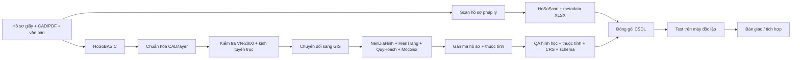

# 🗺️ TT16 — 35 Clean Template Geodatabase cho CSDL quy hoạch đô thị & nông thôn

> Bộ template File Geodatabase phục vụ **cụ thể hóa Phụ lục II Thông tư 16/2025/TT-BXD**: **34 tỉnh/thành + 01 mẫu liên tỉnh/múi chiếu 6°**. Repository đi từ hồ sơ gốc → hồ sơ pháp lý số hóa → GIS → QA/QC → đóng gói bàn giao/tích hợp.

[](https://vanban.chinhphu.vn/?classid=1&docid=214424&pageid=27160&typegroupid=6)
[](https://chinhphu.vn/?classid=2629&docid=218798&pageid=27160)
[](./templates/generated/)
[](./docs/QA.md)

## 1. Mục tiêu

Repository giúp cơ quan quản lý, đơn vị tư vấn và cán bộ lập quy hoạch xây dựng bộ hồ sơ điện tử có cấu trúc rõ ràng, dễ kiểm tra và thuận lợi tích hợp vào hệ thống thông tin/CSDL quốc gia về hoạt động xây dựng.

**Ba khối hồ sơ chính:**

- `HoSoBASIC`: dữ liệu gốc có thể biên tập/in ấn.
- `HoSoScan`: dữ liệu pháp lý được số hóa từ hồ sơ giấy/chứng thực điện tử.
- `HoSoGIS`: dữ liệu địa lý phục vụ tích hợp, quản lý và khai thác GIS.

**Bộ GIS dùng trực tiếp:** 35 **Clean Template FileGDB** trong [`templates/generated/`](./templates/generated/), đã chuẩn hóa schema và loại bỏ dữ liệu mẫu.

> [!IMPORTANT]
> **Căn cứ pháp lý hiện hành:** tại thời điểm cập nhật **18/08/2026**, nên ưu tiên đọc **Văn bản hợp nhất 59/VBHN-BXD ngày 02/07/2026** (hợp nhất TT16/2025, TT43/2025 và TT24/2026). TT43/2025 thay cụm từ “quy hoạch sử dụng đất” bằng **“sử dụng đất quy hoạch”** tại Phần 2 và Phần 3 Phụ lục II.

> [!CAUTION]
> Bộ `.gdb` trong repository là **template kỹ thuật được chuẩn hóa từ bộ dữ liệu nguồn đã cung cấp**, không tự động được xem là “mẫu chính thức do Bộ Xây dựng phát hành” nếu không có nguồn/văn bản công bố tương ứng. Khi nộp chính thức phải đối chiếu văn bản hiện hành và yêu cầu của hệ thống tiếp nhận.

## 2. Cấu trúc thư mục hồ sơ

```text
CSDL_<TenDoAnQuyHoach>/
├── HoSoBASIC/
│   ├── BanVe/
│   └── VanBan/
├── HoSoScan/
│   ├── BanVe/
│   ├── VanBan/
│   └── <MaHoSo>.xlsx
└── HoSoGIS/
    ├── NenDiaHinh.gdb
    ├── HienTrang.gdb
    ├── QuyHoach.gdb
    ├── MocGioi.gdb
    └── <TenDAQH>.<aprx|qgz|...>
```

Tạo nhanh khung thư mục:

```bash
python tools/scaffold.py QHC_Xa_ABC --out ./work
```

## 3. Quy trình thực hiện



Chi tiết: **[docs/QUY_TRINH.md](./docs/QUY_TRINH.md)**  
Checklist: **[docs/CHECKLIST.md](./docs/CHECKLIST.md)**

## 4. HoSoBASIC

### `BanVe/`

Lưu dữ liệu thiết kế/gốc có thể tiếp tục chỉnh sửa và bản PDF xuất từ CAD.

```text
HoSoBASIC/BanVe/
├── BanDo_HienTrangSuDungDat.dwg
├── BanDo_HienTrangSuDungDat.pdf
└── Xref/
```

### `VanBan/`

```text
HoSoBASIC/VanBan/
├── BaoCao_ThuyetMinh.docx
├── PhuLuc_ChiTieu.xlsx
└── BaoCao_TomTat.pptx
```

## 5. HoSoScan

### Văn bản/thuyết minh/báo cáo

- PDF hoặc PDF/A.
- Ảnh màu nếu bản gốc có màu.
- Độ phân giải tối thiểu **200 dpi**.
- Tỷ lệ quét **1:1**.

### Bản vẽ giấy

- JPG.
- Độ phân giải **từ 300 dpi trở lên**.
- Tỷ lệ quét **1:1**.
- Mỗi bản vẽ là một thư mục; nhiều mảnh thì đánh số thứ tự rõ ràng.

### `<MaHoSo>.xlsx`

Ba sheet:

- `HoSo`
- `BanVe`
- `VanBan`

Chi tiết metadata: **[docs/METADATA.md](./docs/METADATA.md)**.

## 6. HoSoGIS — hợp đồng schema chuẩn hóa

| Khối | Số lớp | Vai trò |
|---|---:|---|
| `NenDiaHinh.gdb` | **4** | Nền địa hình/nền địa lý |
| `HienTrang.gdb` | **67** | Dữ liệu chuyên đề hiện trạng |
| `QuyHoach.gdb` | **79** | Dữ liệu chuyên đề quy hoạch |
| `MocGioi.gdb` | **3** | Mốc giới quy hoạch |

### Quy ước tên lớp

- Không dấu, viết liền, chữ hoa đầu từ.
- Hậu tố geometry: `A` = vùng, `P` = điểm, `L` = đường.

Ví dụ:

```text
RanhGioiQuyHoach_A
MangLuoiGiaoThongDuongBo_L
DiemQuanTrac_P
MocGioiQuyHoach_P
```

### Thuộc tính tối thiểu

| Trường | Kiểu | Độ dài | Ý nghĩa |
|---|---:|---:|---|
| `maThongTinQH` | TEXT | 15 | Mã thông tin quy hoạch |
| `maHoSoQH` | TEXT | 15 | Mã hồ sơ quy hoạch |
| `maDoiTuong` | TEXT | 100 | Mã đối tượng |
| `tenDoiTuong` | TEXT | 100 | Tên đối tượng |
| `phanLoai` | TEXT | 250 | Phân loại theo ký hiệu/chú giải |
| `ghiChu` | TEXT | 250 | Ghi chú |

## 7. Trọn bộ 35 template — QA 35/35 PASS

Bộ dùng trực tiếp nằm trong [`templates/generated/`](./templates/generated/). Tất cả ZIP đều được build theo cùng hợp đồng QA: **4/67/79/3 lớp, 01 CRS/template, 0 feature mẫu**.

| # | Mã | Tỉnh/Thành hoặc mẫu | Kinh tuyến trục | HT/QH/MG | QA |
|---:|---:|---|---:|---:|:--:|
| 1 | 01 | Hà Nội | 105°00′ | 67/79/3 | ✅ |
| 2 | 04 | Cao Bằng | 105°45′ | 67/79/3 | ✅ |
| 3 | 08 | Tuyên Quang | 106°00′ | 67/79/3 | ✅ |
| 4 | 11 | Điện Biên | 103°00′ | 67/79/3 | ✅ |
| 5 | 12 | Lai Châu | 104°45′ | 67/79/3 | ✅ |
| 6 | 14 | Sơn La | 104°00′ | 67/79/3 | ✅ |
| 7 | 15 | Lào Cai | 104°45′ | 67/79/3 | ✅ |
| 8 | 19 | Thái Nguyên | 106°30′ | 67/79/3 | ✅ |
| 9 | 20 | Lạng Sơn | 107°15′ | 67/79/3 | ✅ |
| 10 | 22 | Quảng Ninh | 107°45′ | 67/79/3 | ✅ |
| 11 | 24 | Bắc Ninh | 107°00′ | 67/79/3 | ✅ |
| 12 | 25 | Phú Thọ | 104°45′ | 67/79/3 | ✅ |
| 13 | 31 | Hải Phòng | 105°45′ | 67/79/3 | ✅ |
| 14 | 33 | Hưng Yên | 105°30′ | 67/79/3 | ✅ |
| 15 | 37 | Ninh Bình | 105°00′ | 67/79/3 | ✅ |
| 16 | 38 | Thanh Hóa | 105°00′ | 67/79/3 | ✅ |
| 17 | 40 | Nghệ An | 104°45′ | 67/79/3 | ✅ |
| 18 | 42 | Hà Tĩnh | 105°30′ | 67/79/3 | ✅ |
| 19 | 44 | Quảng Trị | 106°00′ | 67/79/3 | ✅ |
| 20 | 46 | Huế | 107°00′ | 67/79/3 | ✅ |
| 21 | 48 | Đà Nẵng | 107°45′ | 67/79/3 | ✅ |
| 22 | 51 | Quảng Ngãi | 108°00′ | 67/79/3 | ✅ |
| 23 | 52 | Gia Lai | 108°15′ | 67/79/3 | ✅ |
| 24 | 56 | Khánh Hòa | 108°15′ | 67/79/3 | ✅ |
| 25 | 66 | Đắk Lắk | 108°30′ | 67/79/3 | ✅ |
| 26 | 68 | Lâm Đồng | 107°45′ | 67/79/3 | ✅ |
| 27 | 75 | Đồng Nai | 107°45′ | 67/79/3 | ✅ |
| 28 | 79 | TP. Hồ Chí Minh | 105°45′ | 67/79/3 | ✅ |
| 29 | 80 | Tây Ninh | 105°45′ | 67/79/3 | ✅ |
| 30 | 82 | Đồng Tháp | 105°00′ | 67/79/3 | ✅ |
| 31 | 86 | Vĩnh Long | 105°30′ | 67/79/3 | ✅ |
| 32 | 91 | An Giang | 104°45′ | 67/79/3 | ✅ |
| 33 | 92 | Cần Thơ | 105°00′ | 67/79/3 | ✅ |
| 34 | 96 | Cà Mau | 104°30′ | 67/79/3 | ✅ |
| 35 | — | Mẫu liên tỉnh / múi chiếu 6° | 105°00′ | 67/79/3 | ✅ |

## 8. QA nghiêm ngặt

QA nhanh ZIP:

```bash
python tools/verify_templates.py templates/generated
```

QA sâu:

```bash
pip install -r requirements-qa.txt
python tools/verify_templates.py templates/generated --deep --expect 35
```

Điều kiện CI cho từng template:

1. ZIP không lỗi CRC.
2. Đủ đúng 4 GDB.
3. `NenDiaHinh=4`, `HienTrang=67`, `QuyHoach=79`, `MocGioi=3`.
4. Có `ChiGioiXayDung_L`, `ChiGioiDuongDo_L`, `HanhLangAnToan_L`.
5. Chỉ **01 CRS** trong toàn template.
6. Clean Template có **0 feature**.
7. Đủ đúng **35 ZIP**.
8. Sinh lại `SHA256SUMS.txt`.

Nếu một điều kiện không đạt, workflow **FAIL và không commit output**.

Xem báo cáo: **[docs/QA.md](./docs/QA.md)**.

## 9. Cách dùng template

1. Chọn ZIP đúng địa phương/hệ tọa độ.
2. Đối chiếu VN-2000, kinh tuyến trục và phạm vi dự án với hồ sơ đo đạc/khảo sát.
3. Giải nén vào `CSDL_<TenDoAn>/HoSoGIS/`.
4. Không đổi tên feature class/feature dataset nếu chưa có mapping rõ ràng.
5. ETL dữ liệu CAD/GIS nguồn vào lớp tương ứng.
6. Điền `maThongTinQH`, `maHoSoQH` và thuộc tính bắt buộc.
7. Kiểm tra geometry/topology, null, mã trùng, CRS, domain và metadata.
8. Lưu project tổng hợp (`.aprx`, `.qgz`...) và test trên máy độc lập.

## 10. Những khác biệt nguồn đã được xử lý

### Nhóm 105°45′

Bộ nguồn từng có 4 template `QuyHoach.gdb` chỉ 76 lớp. Bộ `generated` đã **bổ sung đủ 3 lớp schema còn thiếu** và chuẩn hóa thành 79 lớp cho Cao Bằng, Hải Phòng, TP.HCM và Tây Ninh.

### Điện Biên

Bộ nguồn từng có 8 lớp `NenDiaHinh` với nhóm `_1` dùng CRS khác. Bộ `generated` đã chuẩn hóa về **4 lớp NenDiaHinh + 01 CRS thống nhất**.

### Dữ liệu mẫu

Các feature nền/mã hồ sơ mẫu có trong nguồn không được đưa sang `generated`; toàn bộ Clean Template được tạo rỗng.

> Các dị biệt gốc vẫn được giữ trong metadata provenance để truy vết, nhưng **không còn là cảnh báo của bộ template dùng trực tiếp**.

## 11. Lưu ý nghiệp vụ Phụ lục II

Phần 3 ghi tổng 70 lớp hiện trạng và 81 lớp quy hoạch, nhưng bảng thực tế khuyết các STT `42, 43, 51` ở hiện trạng và `52, 54` ở quy hoạch. Repository sử dụng **67 + 79 feature class có tên/định nghĩa thực tế**, không tự tạo lớp không có định nghĩa.

Hai điểm metadata vẫn cần đối chiếu hệ thống tiếp nhận:

- Sheet `HoSo` được mô tả là “19 cột” nhưng danh sách trường có 20 mục.
- Quy tắc `maHoSoQH` và ví dụ minh họa chưa hoàn toàn đồng nhất ở ký tự `<x>`.

## 12. Bàn giao tối thiểu

```text
[1] HoSoBASIC đầy đủ
[2] HoSoScan đúng định dạng/độ phân giải + <MaHoSo>.xlsx
[3] HoSoGIS đủ 4 GDB
[4] Tên lớp/geometry đúng schema
[5] Thuộc tính bắt buộc đã điền
[6] CRS/hệ tọa độ được xác nhận
[7] Không lỗi geometry/topology nghiêm trọng
[8] Project tổng hợp mở được
[9] Test trên máy độc lập
[10] Đóng gói CSDL_<TenDoAn>.zip + checksum/biên bản
```

## 13. Cấu trúc repository

```text
TT16/
├── README.md
├── templates/
│   ├── generated/                 # 35 Clean Template ZIP + SHA256SUMS
│   └── index.csv                  # provenance/checksum bộ nguồn
├── docs/
│   ├── QUY_TRINH.md
│   ├── CHECKLIST.md
│   ├── METADATA.md
│   ├── QA.md
│   ├── PHAP_LY.md
│   └── CLEAN_TEMPLATES.md
├── schema/                        # catalog schema/CRS
├── tools/
│   ├── scaffold.py
│   ├── build_clean_templates.py
│   └── verify_templates.py
├── .github/workflows/build-clean-templates.yml
└── requirements-qa.txt
```

---

**Nguyên tắc:** `source` để truy vết; `generated` để sử dụng. Bộ `generated` chỉ được phát hành khi **QA = 35/35 PASS**. Văn bản pháp luật hiện hành và yêu cầu của cơ quan tiếp nhận vẫn là căn cứ quyết định khi lập hồ sơ chính thức.
